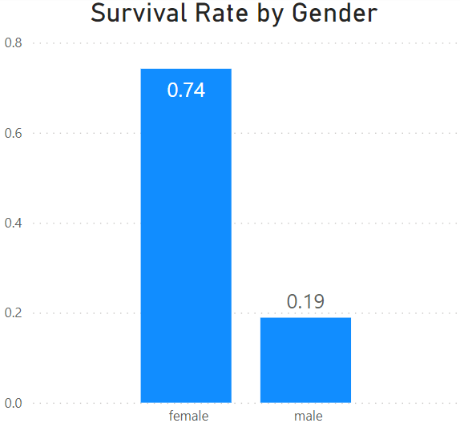

# Titanic Survivors Analysis

**Author**: [Jin-hoon Chung](mailto:ddjh204@gmail.com)

# Overview
I still remember the Titanic movie. Titanic was the first movie I watched in the theater, and I was in high school. And it was the first movie that taught me I could watch a movie twice.

When I was learning data science at Flatiron school, the learning materials introduced me a dataset related to the Titanic sinking. It was exciting to check out the real Titanic data, but the learning materials did not dive deep into the dataset. I wanted to play with the datset one day after graduating the Data Science program, and now is the time!

# Goal
There are a few goals of this project. First of all, I want to review what I have learned and refresh my mind before doing other projects. One thing I plan to practice is classification. Using classification, I can find out which passenger features are most impact to the survivals.

# Data
There is one dataset. It can be downloaded from [Kaggle](https://www.kaggle.com/competitions/titanic/data).

## Data Review / EDA
There are 12 columns in the dataset, but several columns are removed because they are not helpful understanding the survival. Below are the details of columns that are used in the analysis.

column names | Info
--- | ---
Survived | Information if one passenger is survived or not
Pclass | Ticket Class where 1 is the highest
Sex | Gender
Age | How old one passenger is
SibSp | Number of siblings or spouses aboard Titanic
Parch | Number of parents or children aboard Titanic
Fare | Passenger fare
Embarked | Port of Embarkation

The dataset has details of around 900 passengers. Please see the details below.

Survived | Count
--- | ---
No | 549
yes | 342

Gender | Count
--- | ---
Male | 577
Female | 314

Ticket Class | Count
--- | ---
1st | 216
2nd | 184
3rd | 491

The most fares is below $50.


Ages between 20 and 30 has the highest count.


# Analysis

## Baseline Models

To determine the best model, I have chose five baseline models. They are logistic regression, decision tree, random forest, adaboost, and gradient boosting. Below are the test scores for each model.

Model | Test Score
--- | ---
Logistic Regression | 79.39%
Decision Tree | 75.34%
Random Forest | 78.03%
Adaboost | 76.23%
Gradient Boosting | 79.82%

The highest score is from gradient boosting. Let's try oversampling and check the scores again.

## Optimization
### Oversampling

A Smote library is used to oversample the dataset. This method will oversample the lower number of cases to match the count with the higher number of cases. This dataset has lower number of survived passengers. Therefore, this technique will oversample survived passengers to have an equal count of not-survived passengers.

Let's check the scores again after oversampling.

Model | Test Score | Score with smote
--- | --- | ---
Logistic Regression | 79.39% | 79.82%
Decision Tree | 75.34% | 72.65%
Random Forest | 78.03% | 77.13%
Adaboost | 76.23% | 75.78%
Gradient Boosting | 79.82% | 81.61%

It seems some models prefer oversampling while others do not. Gradient boosting has higher score and is still the highest! Gradient boosting model is chosen for the next step.

### Tuning

Gradient boosting model has parameters that can be tuned. The tuned parameters are loss, n_estimaters, min-samples_split, min_samples_leaf, max_depth, and max_features. The details can be found at **4_titanic_optimization_gridsearch**.

The test scores after tuning is 77.58% which is lower than the score from the baseline gradient boosting. This analysis sticks to the baseline model for the final step.

# Result
This section checks two results, one from classification modeling and other from correlation.

## Classification
Classification method was shown in the previous steps. It is time to see which passenter features have the highest impact to determine the survivals.


Gradient boosting shows that sex, age, and fare has the highest impact in the analysis

## Correlation
Correlation is to show how two columns are related to each other. This method shows scores, too.


Correlation shows sex, ticket class, and fare has the biggest relation with the survivals. Embarkation has the 4th highest. This is not the totally same as what we see from classification. It is always good to check any possible ways to see the results.

## Visualization
Now, let's take a look at the percentages of survived passengers by categories.


74% of all female passengers survived while 19% of male passengers survived.


Generally younger passengers have higher survival rate.


Passengers who paid higher price have higher survival rate.


Passengers with higher ticket class have higher survival rate. Heatmap shows ticket class and fare have a high correlation.

# Conclusion
Visualization shows how passenger features are related to the survival. Passengers that are female, younger, and wealthier have higher survival rate. 

# Repository Structure

```
├── data
├── images
├── 1_titanic_EDA_and_Base_Model.ipynb
├── 2_titanic_heatmap.ipynb
├── 3_titanic_smote.ipynb
├── 4_titanic_optimization_gridsearch.ipynb
├── 5_titanic_optimization_gridsearch_LR.ipynb
├── data_preparation.py
├── README.md
└── titanic.pbix